# 🛒 FreshCart

[](LICENSE)
[](https://getbootstrap.com/)
[](https://vercel.com/)

---

## 📄 Description

**FreshCart** is a modern and responsive **eCommerce website template** built using **Bootstrap**.  
It features clean layouts, beautiful UI components, and a fully responsive design that adapts seamlessly to any device.

This template is perfect for building stylish online stores quickly and efficiently.

🔗 **Live Demo:**  
👉 [https://fresh-cart-xi-blush.vercel.app/](https://fresh-cart-xi-blush.vercel.app/)

---

## ✨ Features

✅ Modern, clean user interface  
✅ Fully responsive layout for mobile and desktop  
✅ Reusable Bootstrap components  
✅ Bootstrap Icons integration  
✅ Easy to customize

---

## 🛠 Technologies Used

- **HTML**
- **CSS**
- **JavaScript**
- **Bootstrap**
- **Bootstrap Icons**

---

## 🖥️ Screenshots


Example:

```markdown
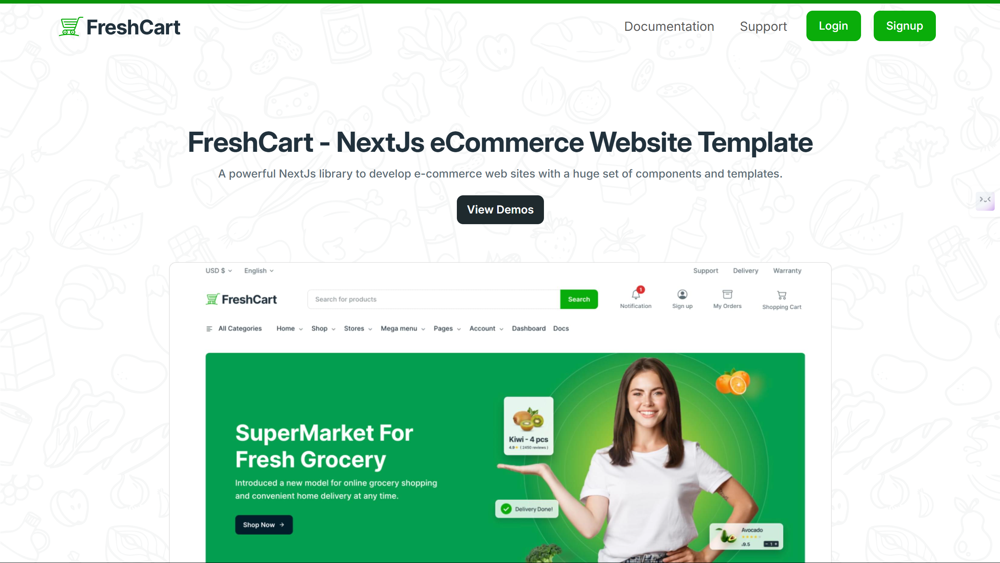
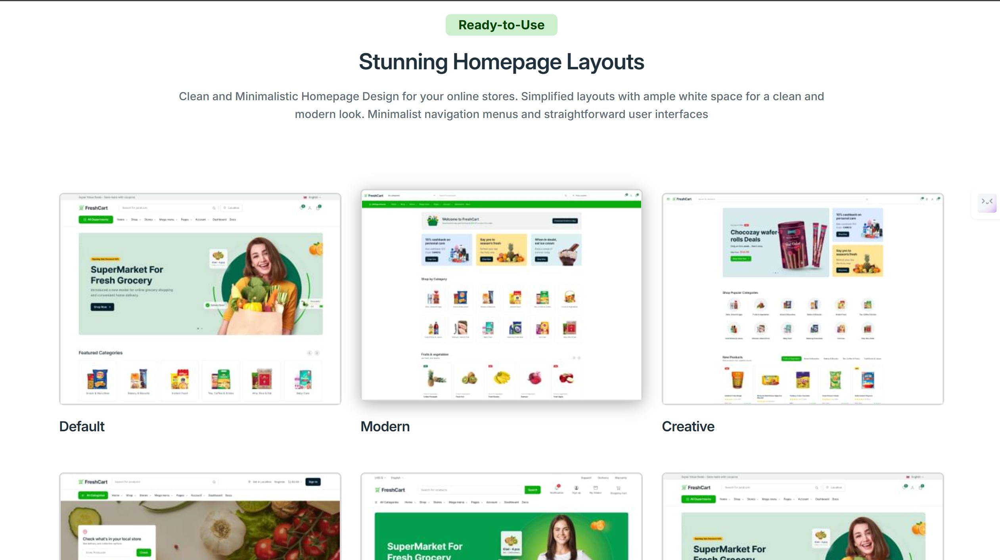
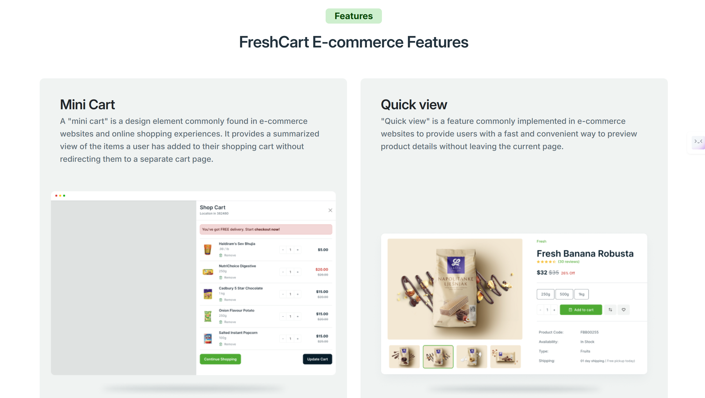
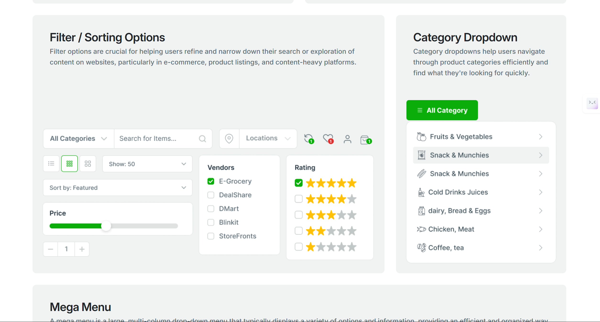
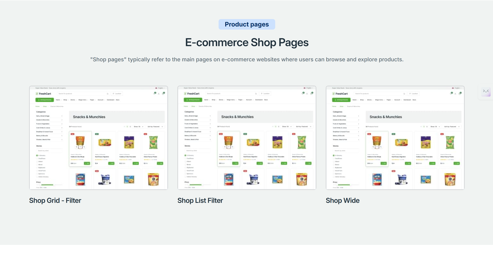
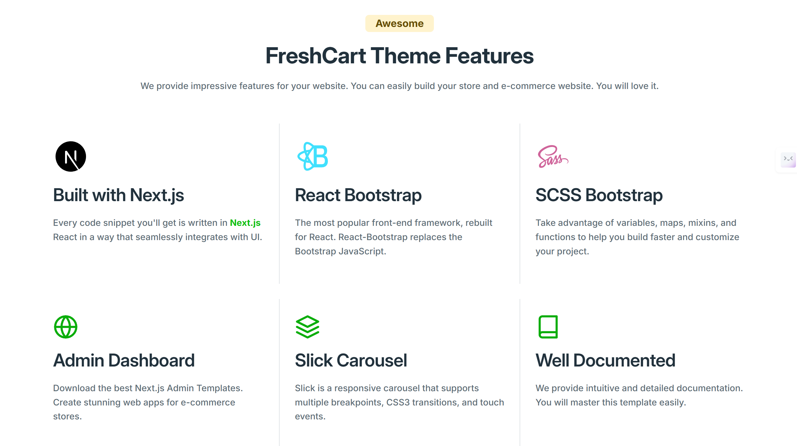
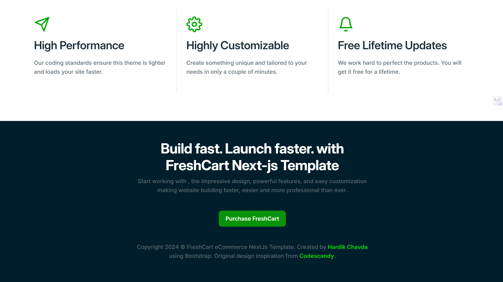
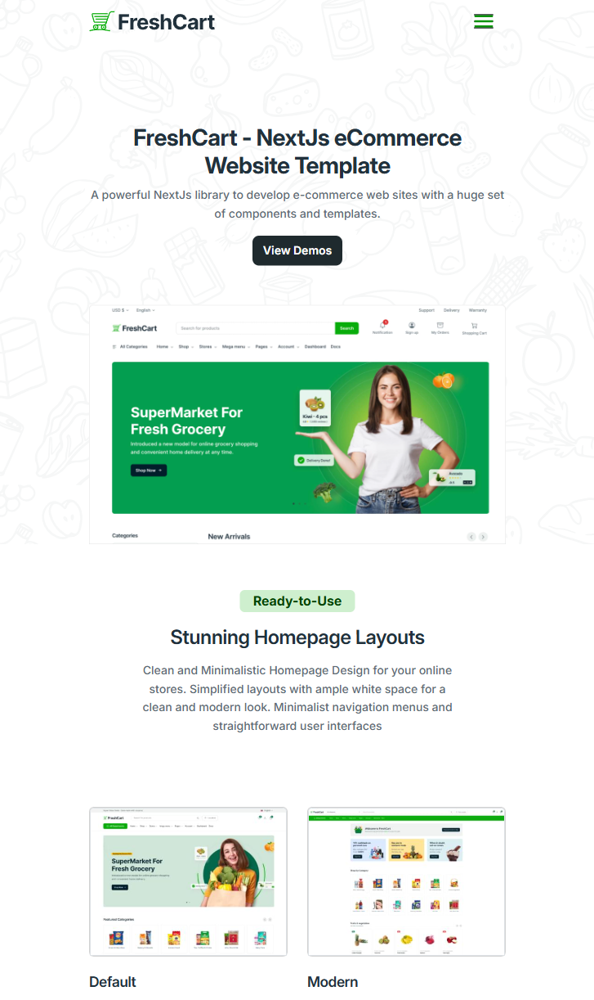

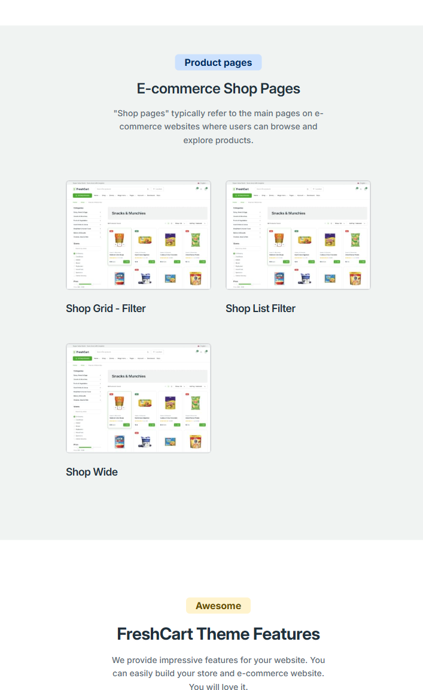
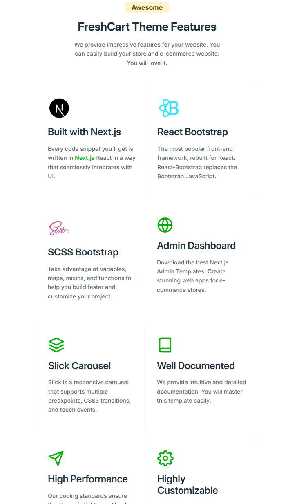
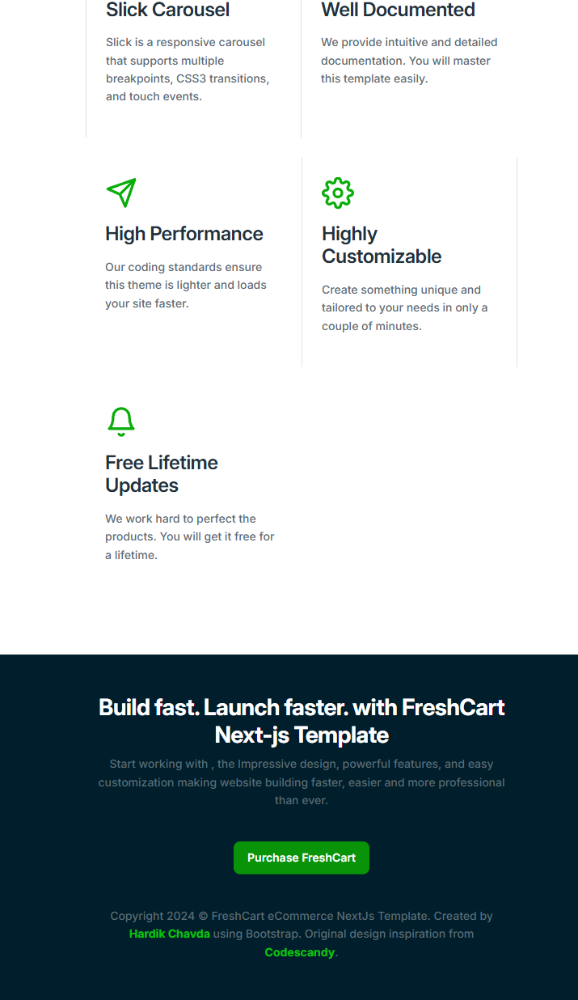
